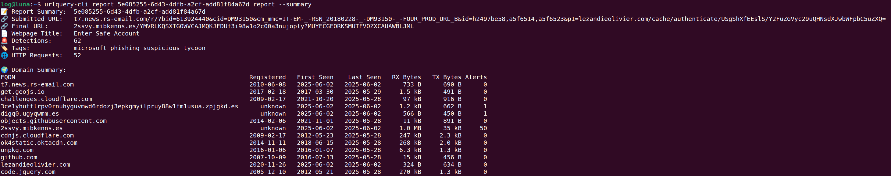

# urlquery-cli

A command-line tool for interacting with [urlquery.net](https://urlquery.net), allowing you to submit URLs for analysis, check URL reputations, and download reports, screenshots, and resources.

## Features

- Submit URLs for threat analysis
- Check reputation of URLs
- Retrieve scan results including:
  - JSON reports
  - Screenshots
  - Domain graphs
  - Specific resource files by hash
- Custom user-agent and access control
- Configurable via CLI flags or config file

---

## Installation

```bash
go install github.com/urlquery/urlquery-cli@latest
```

Or clone and build manually:

```bash
git clone https://github.com/urlquery/urlquery-cli.git
cd urlquery-cli
go build -o urlquery-cli .
```

---

## Configuration

Set your API key (required):

```bash
urlquery-cli config set apikey <your-api-key>
```

Optional settings:

```bash
urlquery-cli config set useragent "curl/7.81.0"
urlquery-cli config set access "private"
```

---

## Usage

### Submit a URL

```bash
urlquery-cli submit https://urlquery.net
```

You can configure visibility and user-agent via config or flags.

### Check submission status

```bash
urlquery-cli submit status <queue_id>
```

### Check URL reputation

```bash
urlquery-cli reputation google.com
```

### Retrieve scan results

```bash
urlquery-cli report <report_id> report
urlquery-cli report <report_id> screenshot
urlquery-cli report <report_id> domain_graph
urlquery-cli report <report_id> resource <hash>
```

You can specify an output directory with `--output`:

```bash
urlquery-cli report <report_id> screenshot --output ./downloads
```

Get a quick summary of the data with `--summary`:

```bash
urlquery-cli report <report_id> report --summary
```


---

## Examples

```bash
# Submit a URL for scanning
urlquery-cli submit https://urlquery.net

# Get scan report
urlquery-cli report 5e085255-6d43-4dfb-a2cf-add81f84a67d report
```

```bash
urlquery-cli report 5e085255-6d43-4dfb-a2cf-add81f84a67d report --summary
```


---

## Development

Build locally:

```bash
go build -o urlquery-cli .
```

Run a command:

```bash
./urlquery-cli help
```

---

## License

MIT © [urlquery.net](https://urlquery.net)
